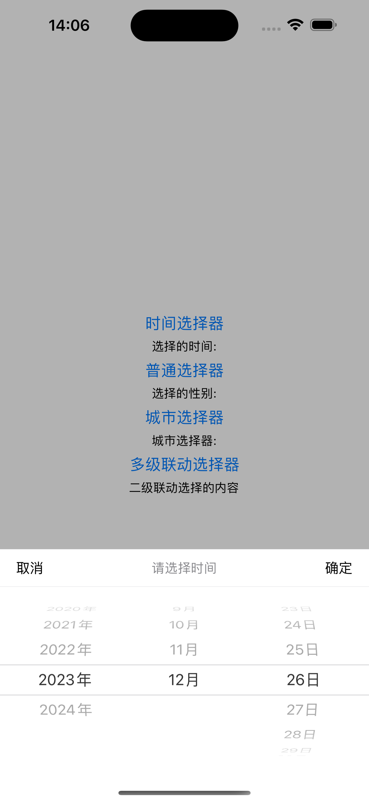
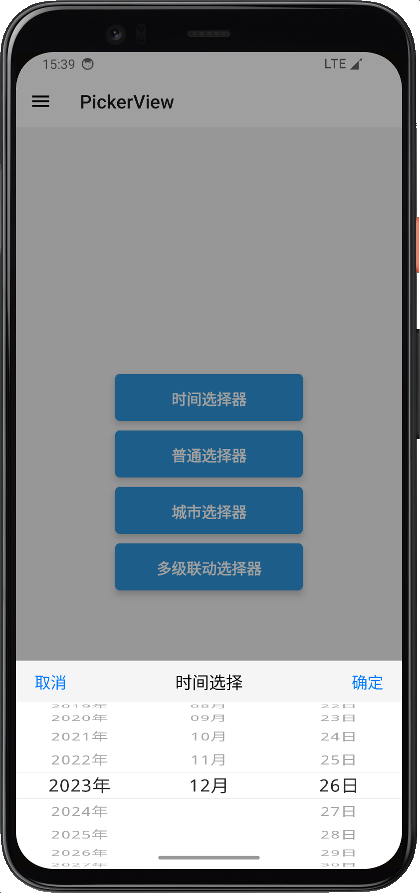
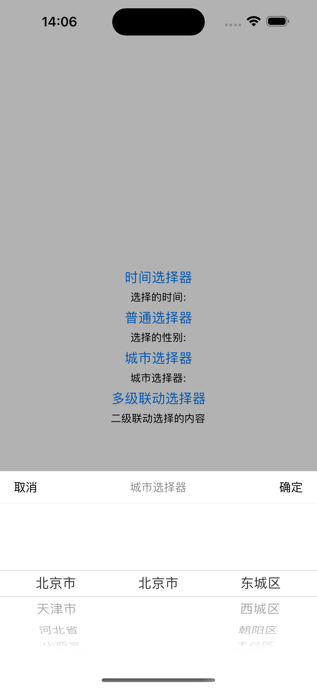
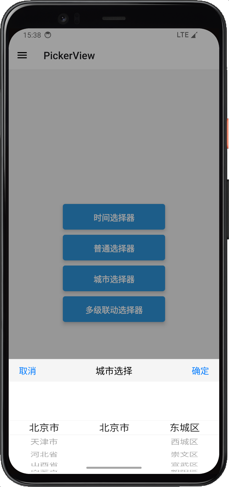
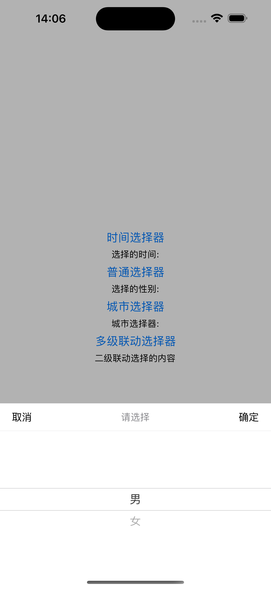
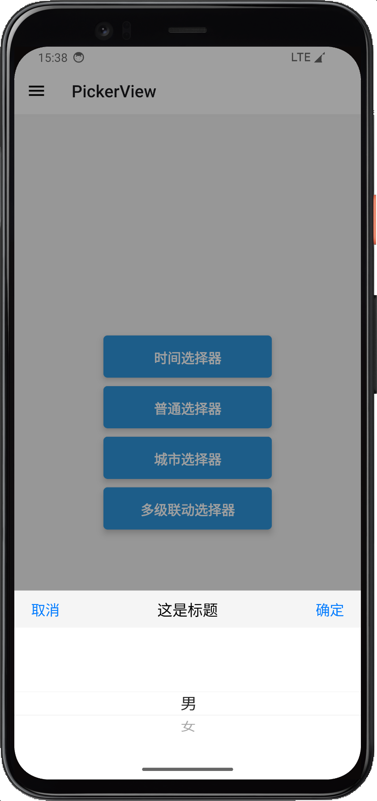
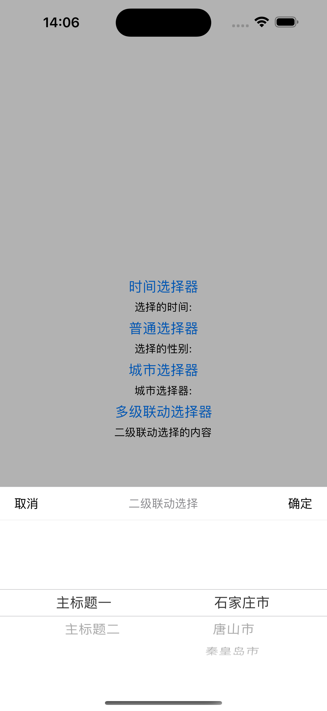
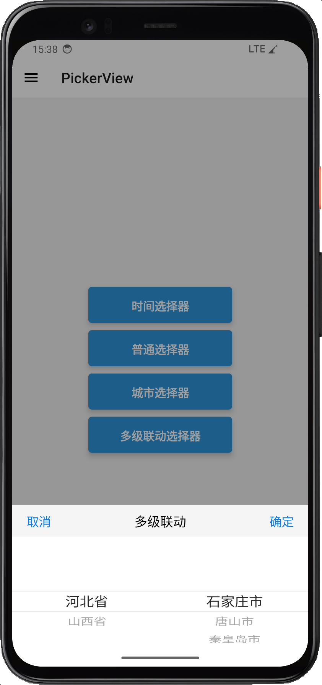

# react-native-ui-kit-picker

Native selector for Android and ios

## 功能介绍
基于已有的第三方框架来实现Android和iOS的时间、城市、普通选择器,适用于 React Native App。

### 原生框架依赖
* Android：[Android-PickerView](https://github.com/Bigkoo/Android-PickerView)  - by [Bigkoo](https://github.com/Bigkoo/)
* iOS：[BRPickerView](https://github.com/91renb/BRPickerView)  - by [91renb](https://github.com/91renb/)

### 功能特点
* 支持Android和iOS
* 支持时间选择
* 支持城市选择
* 支持普通选择
* 支持二级联动选择

## 安装

```sh
npm install react-native-ui-kit-picker
or
yarn add react-native-ui-kit-picker
```


## Example

```sh
yarn example
```

## 效果演示
<div style="display: flex; flex-direction: row;">
<div style="flex: 1;">
<h2>iOS时间选择器</h2>

</div>
<div style="flex: 1;">
<h2>Android时间选择器</h2>

</div>
</div>
<div style="display: flex; flex-direction: row;">
<div style="flex: 1;">
<h2>IOS城市选择器</h2>

</div>
<div style="flex: 1;">
<h2>Android城市选择器</h2>

</div>
</div>
<div style="display: flex; flex-direction: row;">
<div style="flex: 1;">
<h2>iOS普通选择器</h2>

</div>
<div style="flex: 1;">
<h2>Android普通选择器</h2>

</div>
</div>
<div style="display: flex; flex-direction: row;">
<div style="flex: 1;">
<h2>iOS二级联动选择器</h2>

</div>
<div style="flex: 1;">
<h2>Android二级联动选择器</h2>

</div>
</div>


## Usage

```js
import { ShowTimePicker,ShowNormalPicker,ShowCityPicker,ShowLinkagePicker } from 'react-native-ui-kit-picker';

let defaultArray  = [
  {
      "label":'主标题一',
      'value':[
          {
              "label":'石家庄市',
              'value':'1'
          },
          {
              "label":'唐山市',
              'value':'2'
          },
          {
              "label":'秦皇岛市',
              'value':'3'
          }
      ]
  },
  {
      "label":'主标题二',
      'value':[
          {
              "label":'太原市',
              'value':'1'
          },
          {
              "label":'大同市',
              'value':'2'
          },
          {
              "label":'阳泉市',
              'value':'3'
          }
      ]
  }
]

export default function App() {

  const [time,setTime] = React.useState('')
  const [sex,setSex] = React.useState<{label?:string,value?:string}>({})
  const [city,setCity] = React.useState({
    province:'',
    city:'',
    area:''
  })
  const [label,setLabel] = React.useState('')

  console.log('new Date',new Date('2020-01-01'))

  return (
    <View style={styles.container}>
      <Button title={'时间选择器'}  onPress={()=>{
                ShowTimePicker({
                    pattern:'yyyy-MM-dd',
                    title:'请选择时间',
                    mixDate:'2020-01-01',
                    maxDate:'2024-12-31',
                    selectDate : time
                }).then(res=>{
                    console.log('res',res)
                    setTime(res)
                })
            }}/>
     <Text>选择的时间:{time}</Text>
     <Button title={'普通选择器'} onPress={()=>{
                ShowNormalPicker({
                    array:[
                        {label:'男',value:'1'},
                        {label:'女',value:'2'},
                    ],
                    selectItem:sex
                }).then(res=>{
                    console.log('res',res.label)
                    setSex(res)
                })
            }}/>
    <Text>选择的性别:{sex.label}</Text>
    <Button title={'城市选择器'} onPress={()=>{
                ShowCityPicker({
                  title:'城市选择器',
                  selcetCity:city
                }).then(res=>{
                    console.log('res',res)
                    setCity({
                        province:res.province,
                        city:res.city,
                        area:res.area
                    })
                })
            }}/>
    <Text>城市选择器:{city.province + city.city + city.area}</Text>
    <Button title={'多级联动选择器'} onPress={()=>{
                ShowLinkagePicker({
                    array:defaultArray
                }).then(res=>{
                    console.log('res',res)
                    setLabel(`${res.label}-${res.value.label}`)
                }).catch(err=>{
                    console.log('err',err)
                })
            }}/>
        <Text>二级联动选择的内容{label}</Text>
    </View>
  );
}


```
## License

MIT

---

Made with [create-react-native-library](https://github.com/callstack/react-native-builder-bob)
